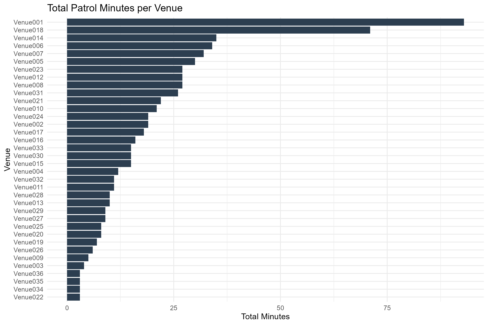
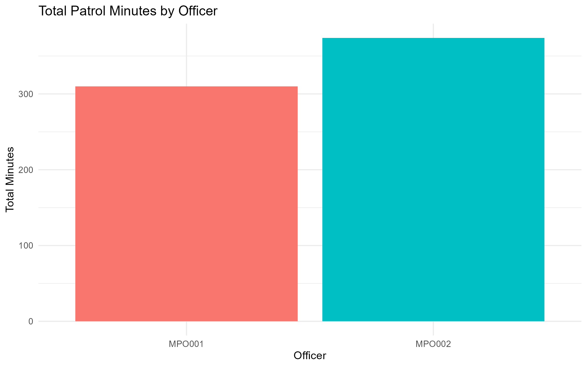
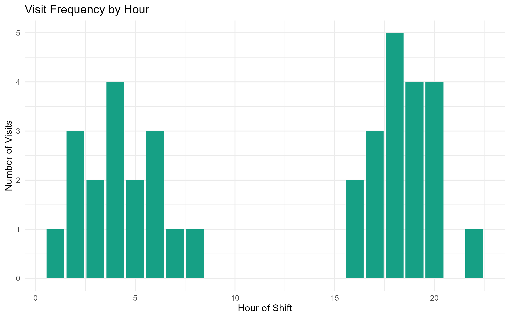
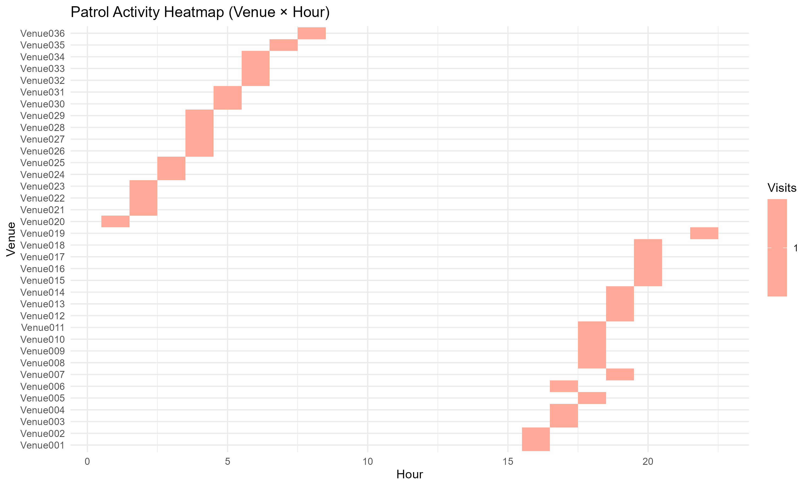

## Overview

This report summarises anonymised operational patrol visit data for a single overnight shift.
It demonstrates a reproducible workflow: **Excel → R cleaning → KPI summaries → visual outputs**.

## Load clean data

```{r}
library(tidyverse)

df <- read_csv("../outputs/tables/jan01_cleaned.csv")

df %>% 
  select(shift_date, shift_type, mpo_name, venue, visit_order, duration_minutes, hour) %>% 
  head()
```

```{r}
kpi_overall <- df %>%
  summarise(
    total_visits = n(),
    total_patrol_minutes = sum(duration_minutes),
    average_visit_minutes = mean(duration_minutes),
    median_visit_minutes = median(duration_minutes),
    min_visit_minutes = min(duration_minutes),
    max_visit_minutes = max(duration_minutes)
  )
kpi_overall
```

```{r}
venue_summary <- df %>%
  group_by(venue) %>%
  summarise(
    visits = n(),
    total_minutes = sum(duration_minutes),
    avg_minutes = mean(duration_minutes)
  ) %>%
  arrange(desc(total_minutes))

venue_summary
```

```{r}
officer_summary <- df %>%
  group_by(mpo_name) %>%
  summarise(
    visits = n(),
    total_minutes = sum(duration_minutes),
    avg_minutes = mean(duration_minutes)
  ) %>%
  arrange(desc(total_minutes))

officer_summary
```

```{r}

```

```{r}

```

```{r}

```

```{r}

```

## Insights

- Patrol workload is unevenly distributed across venues.
- Activity appears concentrated in specific hours of the shift.
- Officer workload distribution can be compared using total patrol minutes.

## Recommendations

- Review high-duration venues for operational efficiency.
- Focus staffing coverage during peak patrol hours.
- Extend analysis to multi-day dataset to confirm patterns.

---

## Next (Step B4): Render it
1) Open `report/jan01_report.qmd`  
2) Click **Render** (top of the editor)

It should create:
`report/jan01_report.html`

---

## If Render fails (quick check)
Run this in Console:

```r
file.exists("outputs/tables/jan01_cleaned.csv")
file.exists("outputs/figures/01_total_minutes_per_venue.png")

